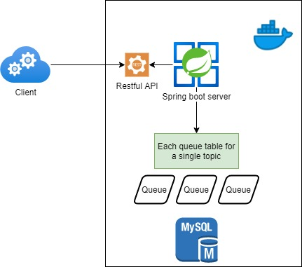

[]()
[]()
# Java coding test

A Java coding skill test for Merpay backend's/DataPlatform.

[日本語](SKILL_TEST.ja.md)

[English](SKILL_TEST.en.md)


# Phase 1
## Usage
### Hot to run
- Step 1. run `$ ./gradlew build` to build project
- Step 2. run `$ docker-compose up --build`

### API usage
#### Pub
- Step 1. Register topic
`GET http://localhost:8090/topic/register?topic=<TOPIC_NAME>&client=<PUB_CLIENT_NAME>`

- Step 2. Publish message
`POST http://localhost:8090/message/publish`
```JSON
# Body
{
    "topic": "<TOPIC_NAME>",
    "client": "<PUB_CLIENT_NAME>",
    "content": "<ANY_CONTENT>"
}
```

#### Sub
- Step 1. Subscribe
`GET http://localhost:8090/topic/subscribe?topic=<TOPIC_NAME>&client=<SUB_CLIENT_NAME>`
- Step 2. Get message
`GET http://localhost:8090/message/get?topic=<TOPIC_NAME>&client=<SUB_CLIENT_NAME>`
- Step 3. Ack message
`POST http://localhost:8090/message/ack`
```JSON
# Body
{
    "topic": "<TOPIC_NAME>",
    "client": "<SUB_CLIENT_NAME>",
    "msgId": long number id
}
```
#### Check in DB
`http://localhost:8888/`

server is your local router ip e.x. `192.168.x.x`

user name is `root`

pass word is `root`

db is `merpay`

## Architecture


- Web application is based in Spring boot
- DB is using MySql
- Each topic will create a dedicated table
- Client use RESTful http endpoint to access the server API


# Phase 2
## The enhansment points
- High performance
- High Availability

## Solution
### High performance
- Use spring netty to replace traditional embaded tomcat model
- Use WebFlux to replace sync API
  - Netty WebFlux tremendously increasing the server throttle limitation

### High Availability
- Deplyed to Kubernetes
- Start an autoscalling servcie by cpu usage
  - Define Kubernetes deployment file in ./deployment.yml
  - When cpu useage up to 70% will trigger autoscalling
  - Minimum instance is 1 and maximum is 5

### Hot to run
Same as the phase1

### API usage
All the API upgrated to reactive version, old API be moved to `/sync/` directory 